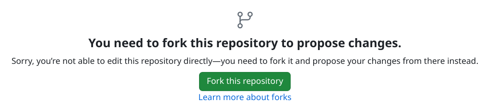
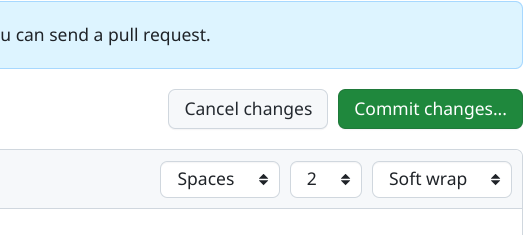
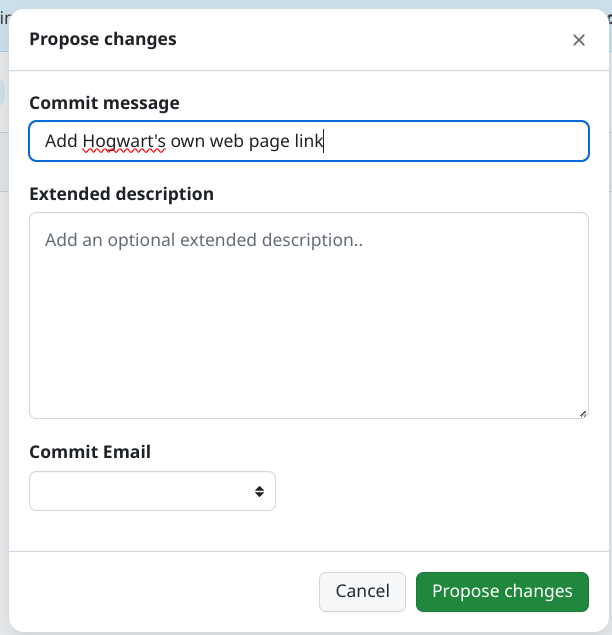

# Rules / Conduct.

See something you want to fix?  Here are the rules for contributing to this repository.

1. You should be someone cares that COVID-is-Airborne and that we can mitigate virus transmission by better ventilation work in indoor settings
2. You will not try to platform other agenda items. Both anti-vax and pro-vax people may disagree on that but agree on ventilation, air-filtration, CO2 monitoring for schools. Vaccines is just one divisive topic that should be left elsewhere.
3. **Be nice** and focus on the school-ventilation aspect of this work. That is be nice to each other and to school officials, etc. That should cover what we write for the site and the systems supporting this activity, but on the phone or in person with others too. Read HBR's [How to Disagree with Someone More Powerful than You](https://hbr.org/2016/03/how-to-disagree-with-someone-more-powerful-than-you). Know that school officials are under pressure from people far above them in terms of power, too.
4. Don't overwhelm school officials, during your research activities. As noted before, they are under pressure. 
5. Related: If you're in contact with a school itself already (you have kids there) then use the channels you already have to get facts. If you've no kids in that school then maybe only get facts to add to a school's page from searching online - and don't yourself make contact with the school officials.
6. Don't write "School principal Freddie told me they would never do X or Y on the phone" - Instead link to authoritative sources, and change the school's page. "Focus group members raised the need to do X and Y on July 1st 2024, without school agreement to do them at that time"
7. No [doxing](https://en.wikipedia.org/wiki/Doxing).
8. Own your mistakes and be objective - be ready to fix-up or improve something you're in the process of contributing.
9. Don't use anonymous participation in this work to be obnoxious. Everything we want is perfectly reasonable and legal to push for so use your real name if you can. That's also why we ask you to be polite.
10. Seek help with the dual language aspects of this work if you need to. e.g. Welsh **AND** English are official languages in Wales. 
11. Use Pull-Requests (GitHub concept, see below for an easy enough workflow) please. Work with someone who has pull-request skills and experience, and trust that it is not hard to learn. Issues for each GitHub repo is also open for contribution but it less respectful of maintainers time who would typically prefer Pull-Requests.
12. If you organize outside the confines of this GitHub repo for your school, please follow the same rules (high esteem, be nice, no doxing), and link to that effort in the page. Be open to others reaching out in that channel. Be wary of infiltration by people/bots that do not want ventilation or air-filtration for schools.

# What is GitHub?

Welcome to a bedrock of the software development industry. FOR US, GitHub is the portal WE use for editing and hosting 
of the generated website. Editing school pages requires you to first create an account on [GitHub.com](https://github.com/signup) 
and log into it. Contributions are placed in an are for review called "Pull Requests". Others will complete them from 
there. If so, your changes go live in about one minute after someone reviews then accepts your proposed changes. They 
may of course suggests changes on the comments on a "pull request" (see below). If they do, please consider any 
suggested actions. It could be they accept your contribution them immediately make small changes themselves - that's OK.

We have a [Why GitHub](/site-technologies/) rationale, too.

## Self setup for making changes on GitHub

First, Make an account on [GitHub.com](https://github.com). Please use a real name or something that passes for it: SamWilliams1234. 
Pick 'free' option when it comes up rather that one of the monthly-fee options.

### Making a change to a page

Find the page you want to change, click the "Edit this page" link at the bottom,

Next, you'll see a page on GitHub that suggests you "fork" the repository that hold the site source code, and you'd click 
it to do so:

|                             | 
|:---------------------------------------------------------------------------------------:| 
| Screen cap of part of a GitHub page showing a "fork repo to change" button that's green |

Now, you're in the editor. You should be familiar with markdown at this stage, and the rules of THIS page. Make your 
changes

When you're ready, click "Commit changes" towards the top of the page on the right:

|                             | 
|:---------------------------------------------------------------------------------------:| 
| Screen cap of part of a GitHub page showing a "button" button that's green |

You should pick a nice short communicative summary of the change you're trying to propose:

|                                            | 
|:----------------------------------------------------------------------------------------------:| 
| GitHub page screen cap showing a green "propose changes" button and a text dialog |

Then hit that green "Propose changes" button.

On the next "comparing changes" page hit the "create pull request" button - green on the right hand side

Finally, on a "Open a pull request" page, hit "create pull request" again - green and at the bottom of the page

Now the change you propose will be considered by the team maintaining the site. Watch out for emails - you might get 
pulled into a conversation on the change.