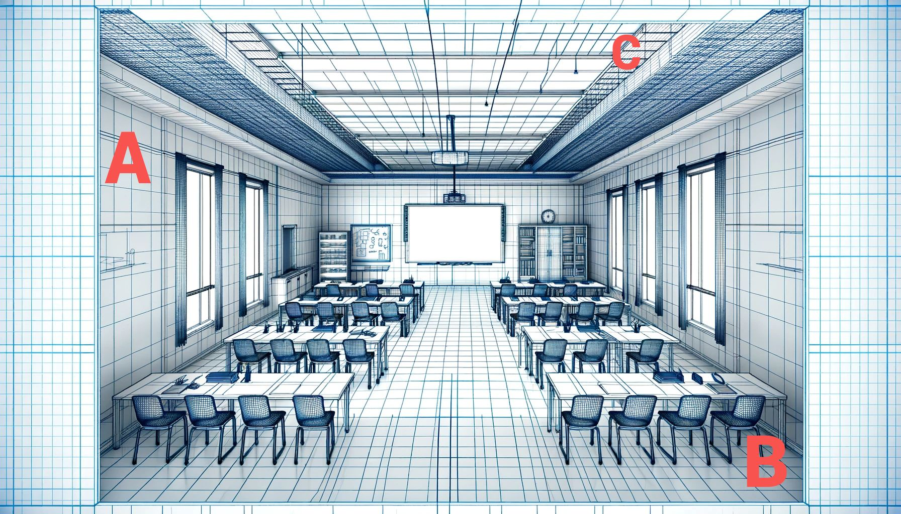
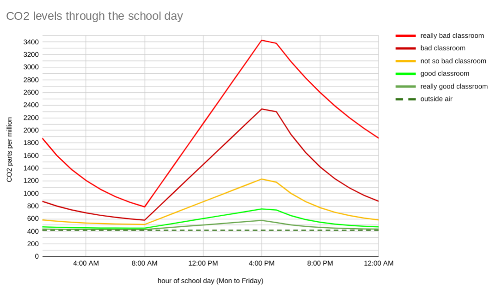

# Kids and teachers being sick all the time is not normal

COVID-19 has weakened people's immune systems to many diseases. Those could be repeat infection of Covid-19, or Flu, RSV, Staph, Strep, Measles, and others.

We have to lower transmission in schools as kids bring it home to parents, too. We **know exactly how to do this** _without_ putting everyone in masks, making people attend school remotely, or implementing any form of lockdown again.

## COVID is Airborne (a fact suppressed at the start)

Given we now know **COVID-19 is airborne** and even the WHO has accepted that with a long "airborne risk assessment" for COVID-19 [(*)](https://iris.who.int/handle/10665/376346), the world is slowly pivoting toward engineering to reduce airborne disease transmission. In March 2024, after the publication of the WHO document, 33 professors and PhDs pushed for a policy change in an article on **Science.org**: [Mandating indoor air quality for public buildings](https://drive.google.com/file/d/16l_IH47cQtC7fFuafvHca7ORNVGITxx8/view).

Know that other diseases are airborne too: Measles (studies [1](https://www.ncbi.nlm.nih.gov/pmc/articles/PMC2810934/pdf/10982072.pdf) [2](https://www.ncbi.nlm.nih.gov/pmc/articles/PMC3880795/pdf/nihms532643.pdf) [3](https://pubmed.ncbi.nlm.nih.gov/31257413/) [4](https://www.sciencedirect.com/science/article/pii/S0196655316305363)), Influenza, RSV, and TB. The same ventilation and air filtration measures reduce transmission of those too.

## Ventilation work for schools allowing healthy full attendance

Better ventilating schools for long-term student and teacher health is the engineering push, but we need to track the progress for that in each country. We should do so ahead of government efforts. If the government starts to track this work, this effort will continue as government efforts might be weak. The published Science.org article highlights schools as a key place for active ventilation work. This should involve mechanical heat recovery ventilation (MHRV), air filtration/cleaning, and CO2 monitoring to drive ventilation levels, as CO2 inside is a proxy indicator for COVID-19 transmission risk. The WHO document details all of these measures too.

When we say student and teacher health, we aim to reduce absences by lowering transmission in schools. We also reduce multi-generation transmission outside schools as kids were bringing COVID-19 home and infecting their parents and grandparents. With lowered transmission, we also reduce the incidence of long COVID, where the worst sufferers have disappeared from education and may be unable to earn a living for the rest of their lives.

# Schools ventilation action plan

To improve school ventilation, there are a number of articles available:

* [Healthy indoor air is our fundamental need: the time to act is now](https://www.mja.com.au/journal/2022/217/11/healthy-indoor-air-our-fundamental-need-time-act-now) - 2022, Professors Lidia Morawska, Guy B Marks, and Jason Monty
* [Designing infectious disease resilience into school buildings through improvements to ventilation and air cleaning](https://static1.squarespace.com/static/5ef3652ab722df11fcb2ba5d/t/60a3d1251fcec67243e91119/1621348646314/Safe+Work+TF+Desigining+infectious+disease+resilience+April+2021.pdf) - 2021, by THE LANCET COVID-19 COMMISSION 
* [John Snow Project on the CDC's standards for air in schools](https://johnsnowproject.org/primers/new-cdc-standards-of-air-hygiene/) - JohnSnowProject.com is a group effort
* [Clean Air Crew on school ventilation](https://cleanaircrew.org/schools/) - CleanAirCrew.org is a group effort

We know we can't eliminate transmission in schools - we're just aiming for a "lower chance of spread" with a reproduction number "RO" under 1.0 per infected student or teacher. [Google search for RO](https://www.google.com/search?q=r0+Basic+reproduction+number) to better understand that.

## School ventilation ideals

The Center for Green Schools (CfGS) has several resources, including an hour-long video on "Unanswered Questions on ASHRAE standard 241 and CDC Ventilation Standard Guidance for Schools":

Twenty-nine minutes in, there's a discussion on air filtration instead of fresh air ventilation for cash-strapped schools. The ASHRAE 241 standard understands the economic constraints of the larger school air quality goals.

ASHRAE 241 refers to a standard published by the American Society of Heating, Refrigerating and Air-Conditioning Engineers (ASHRAE). Specifically, ASHRAE 241-2019 is titled "Standard for Ventilation and Acceptable Indoor Air Quality in Residential Buildings." ASHRAE 241-2019 supersedes the previous version, ASHRAE Standard 62.2-2016. 

CfGS's [25-page toolkit](https://www.usgbc.org/sites/default/files/2024-05/CFGS_IAQ-Toolkit-2024.pdf) is excellent. Their [home page](https://centerforgreenschools.org/).

## A stylized classroom

|  | 
|:----------------------------------------------------:| 
| Blueprint depiction of classroom, with false ceiling tiles removed, and A, B & C denoting placement of equipment. |

### What we need to do per classroom

In 2024, better classrooms are already sealed against outside heat, cold, and pollution. Depending on the latitude, some air conditioning, too.

<!-- Comment: &#8322; is the number two in subscript for CO2 -->

1. Increased fresh air ventilation (heat recovering\*) out through walls (**A**) or ducted at the ceiling level (existing or new).
2. Freestanding (**B**) air cleaning equipment. Equipment can be DIY (see below) or commercial.
  * Or above the ceiling tiles (**C**).
  * Or through the ceiling to roof mounted (**C**) if there is a flat roof above.
3. Monitoring of carbon dioxide (CO&#8322;), which is a "proxy risk" indicator of air that could be carrying viruses from infected people to uninfected people ([Pick a study from Google search results](https://www.google.com/search?q=carbon+dioxide+as+a+proxy+risk+indicator+for+covid19)). The level of CO&#8322; would drive the settings of the ventilation and filtering systems. Only gadgets that use NDIR sensors should be used. Wall mounted or above ceiling tiles, too.
4. We also need legislation that requires the completion of such work in classrooms. The legislation should also certify that the work has been done, inspections to ensure the work is correct, and measures to intervene if the work is not correct.
5. Make it safe in schools for those wanting to wear masks (kids or teachers). We're not going to recommend masks for everyone in a school setting - this site is about pushing for long-term ventilation, air filtration/cleaning, and CO&#8322; monitoring to drive those.

**We should not wait for #4 before getting started on #1, #2, and #3.**

Ideally, #1 & #2 are engineered solutions, fitted by experts and licensed building contractors. You don't have to wait - freestanding works to fill a gap, and the DIY options (see below) are cheap and effective. They are affordable enough to be donated by parent groups. See the *5th Graders Make...* video below.

### CO&#8322; as proxy risk indicator

CO&#8322; builds up as occupants of a room breathe in and out. When occupants leave a room for the final time in a day, CO&#8322; naturally decays towards the outside air concentration (420 parts per million if you're in the countryside). This decay is just slow exchange with lower CO&#8322; ppm air through tiny gaps in walls, windows, and a big gap under the door.

If the windows are open, CO&#8322; will not build up so fast, but there has to be an air current to force air through the room. Over a hundred years ago, Florence Nightingale [campaigned for decades](https://www.google.com/search?q=Florence+Nightingale+stale+air) for windows to be opened to reduce airborne disease transmission in public buildings. She also campaigned for high ceilings in those buildings. Because of the open windows, buildings had to have dialed-up heating systems that would be very expensive today, so we prefer mechanical heat recovery ventilation (MHRV) and energy recovery ventilation (ERV) systems. We can now also scrub the air of viruses (suspended in one-micron size water vapor aerosols) using air filters and cleaners. There are DIY alternatives that are just as good. Air filters do not address the CO&#8322; levels themselves, which can contribute to drowsiness at very high levels. Air filters do address smoke particles from nearby cars and truck exhausts and pollen, though: PM 2.5.`

# Mapping the world's schools

## Proof of concept: Wales and a few other smaller school districts elsewhere

EXPERIMENT: While we prove the concepts of this particular initiative, we are focusing only on Wales within the UK for now, as it has a manageable number of schools and we can gauge community participation in this effort.

* **[See a list of schools in Wales](/Wales/)**
* **Connecticut, USA** (Bridgeport school district only for now)

* You're invited to help edit the data within. Sake a look at one of the Welsh schools and see what is marked as TODO. We have some advice on [contributing and rules](./contributing-and-rules/), some [tools for working on per school entries](./tools-for-working-on-entries/), and a [discussion of the technologies we use for this site](./site-technologies/)

## Other countries?

Other countries may be listed here later. Or states/provinces, or even cities if the list of schools would be too large otherwise. Each of these would need (say) ten people willing to oversee the setup and curation of each school's page. Some of those people should be individuals with significant GitHub skills - maybe software developers who're COVID-is-airborne savvy and have kids themselves. Or a school's IT teacher who doesn't want to get reinfected with COVID again.

If Welsh schools get some traction on this site, we will be open to other countries. For now, we just want every Welsh school graded, then some of them moving in the right direction, before launching a campaign for more areas of the world.

# Grading of schools

Grades of 0 to 5 ("very poor" to "excellent") should be established by 2025.

Note: [NDIR sensors are superior to VOC types](https://en.wikipedia.org/wiki/Carbon_dioxide_sensor#:~:text=many%20industrial%20processes.-,Nondispersive%20infrared%20(NDIR)%20CO2%20sensors,-%5Bedit%5D)

## Grade 0 (very poor)

* Fresh Air Ventilation: No mechanical ventilation or HVAC system. No windows or sealed windows that cannot be opened.
* Recirculation Air Cleaning/Filtering: No air filters or air cleaning mechanisms.
* PM2.5 Measurement: No PM2.5 monitoring.
* CO2 Monitoring (VOC or NDIR): No constant CO2 monitoring - maybe a unit is carried from room to room for spot checks.
  * CO2 Level: Always above 2000 ppm when fully occupied. 
* Classroom Density: High classroom density (> 2.5 students per square meter).

## Grade 1 (poor)

* Fresh Air Ventilation: Windows can be opened but no mechanical ventilation.
* Recirculation Air Cleaning/Filtering: No HVAC system or limited to only heating/cooling. No air filters or substandard filters.
* PM2.5 Measurement: No PM2.5 monitoring.
* CO2 Monitoring (VOC or NDIR): CO2 monitoring intermittent and not automating ventilation.
  * CO2 Level: Often above 2000 ppm when fully occupied.
* Classroom Density: High classroom density (2 to 2.5 students per square meter).

## Grade 2 (below average)

* Fresh Air Ventilation: Basic mechanical ventilation without automation. HVAC system with basic filters.
* Recirculation Air Cleaning/Filtering: Basic air filters or air cleaning mechanisms with limited efficiency.
* PM2.5 Measurement: PM2.5 monitoring may be present.
* CO2 Monitoring (VOC or NDIR): CO2 monitoring likely constant, but not automating ventilation.
  * CO2 Level: Mostly below 1500 ppm when fully occupied.
* Classroom Density: Moderate classroom density (1.5 to 2 students per square meter).

## Grade 3 (average)

* Fresh Air Ventilation: Mechanical ventilation with basic heat recovery, partially integrated with CO2 monitoring.
* Recirculation Air Cleaning/Filtering: HVAC system exists with basic air filtering capabilities.
* PM2.5 Measurement: PM2.5 monitoring exists and actionable insights are provided.
* CO2 Monitoring (VOC or NDIR): CO2 monitoring constant and imperfectly automating ventilation.
  * CO2 Level: Mostly below 1200 ppm when fully occupied.
* Classroom Density: Moderate classroom density (1 to 1.5 students per square meter).

## Grade 4 (good)

* Fresh Air Ventilation: Full mechanical ventilation with heat recovery and CO2-based control for optimal air changes.
* Recirculation Air Cleaning/Filtering: HVAC system with HEPA filters or equivalent for clean inlet air. Advanced air cleaning mechanisms for recirculated air.
* PM2.5 Measurement: PM2.5 monitoring and control measures actively reduce particulate levels.
* CO2 Monitoring (NDIR): CO2 monitoring fully integrated and automating ventilation system.
  * CO2 Level: Always below 850 ppm when fully occupied.
* Classroom Density: Low classroom density (0.5 to 1 student per square meter).

## Grade 5 (excellent)

* Fresh Air Ventilation: Fully integrated mechanical heat recovery ventilation system (MHRV) with CO2-based control.
* Recirculation Air Cleaning/Filtering: HVAC system with high-grade filtration, ensuring filtered and fresh air.
* PM2.5 Measurement: PM2.5 levels consistently below 5 μg/m³.
* CO2 Monitoring (NDIR): CO2 levels consistently below 700 ppm with automated ventilation adjustments.
  * CO2 Level: Always below 700 ppm when fully occupied.
* Classroom Density: Very low classroom density (< 0.5 students per square meter).
* The country/state/province/city in question has building codes for schools (old or new) and performs inspections.

# DIY air filters

## Pics

   <!-- thanks to https://rushabhshahprograms.github.io/ImageSlider-Frontend for the slider -->
   
    

        
        

            

                
                
                
            

            

                
                
                
            

        

        
     

    

Note: Ionization of the air is not recommended as it creates ozone, which is harmful to people. Upper room ultraviolet technology may play a part in virus inactivation as the technology reaches mass production.

## Resources

* [Try this DIY indoor air purifier to get cleaner air](https://www.youtube.com/watch?v=FJFdLbpNK4Y) - 2.5-minute video from Washington Post
* [5th Graders Make DIY Air Purifiers for Entire School](https://www.youtube.com/watch?v=qZzzEKElIFo) - 3-minute video from Jeffco Public Schools (Colorado)
* [The Homemade Air Purifier That’s Been Saving Lives During the COVID-19 Pandemic](https://www.smithsonianmag.com/innovation/homemade-air-purifier-thats-been-saving-lives-during-covid-19-pandemic-180979681/) - Smithsonian Magazine
* [Do-it-yourself portable air cleaners](https://schools.forhealth.org/diy-air-cleaners/) - Schools For Health site
* [This DIY box helps clear indoor air of the coronavirus. Why aren’t more people using them?](https://www.latimes.com/california/story/2022-07-20/diy-push-to-rid-indoor-air-of-covid) - L.A. Times
* [Air filter workshops protect people from dangers of wildfire smoke](https://www.sfu.ca/sfunews/stories/2024/05/sfu-air-filter-workshops-protect-people-from-dangers-of-wildfire.html) - Simon Fraser University (video clip says wildfire smoke but these also scrub covids from the air)

# Global school ventilation improvement efforts so far

* Boston, USA: [CO2 monitors in 4322 classrooms](https://bostonschoolsiaq.terrabase.com/)
* Berkeley, California: [CO2 monitors in 687 classrooms](https://berkeleyusdpublic.iaqdashboard.ca/public-portal.html)
* Lübeck, Germany: [CO2 monitors in 2200 classrooms and 28 nurseries](https://www.luebeck.de/de/stadtentwicklung/smart-city-luebeck/projekte-und-massnahmen/frische-luft-fuer-klare-koepfe.html). See also a [press article on that](https://www.luebeck.de/de/stadtentwicklung/smart-city-luebeck/projekte-und-massnahmen/frische-luft-fuer-klare-koepfe.html)
* Latvia: [CO2 monitors in 875 schools and social centers / 14000 classrooms](https://co2.mesh.lv/)
* Connecticut: Schools have a [state-wide grant for HVAC work to tap into](https://portal.ct.gov/das/grants/hvac-grants?language=en_US) and a [resource on terminology including DIY air filters](https://portal.ct.gov/hvacgrants/-/media/das/office-of-grants-administration/hvac-forms/air-cleaner-and-air-purifier-technology-guidance.pdf)

## NousAerons aite

French group "Nous Aerons" (Let's Air) lists [dashboards that show live CO2 levels for classrooms](https://nousaerons.fr/#dashboards). Their list includes many of the above.

## Covid safety for schools

Australian activists have created [Covid Safety for Schools](https://www.covidsafetyforschools.org/) which is a comprehensive resource for teachers, parents, and students. The materials are initially for Australia but are applicable to any other country on earth. 

# Technologies we use and tools for fact-finding 

* See [site technologies](./site-technologies/)
* See [tools for working on entries](./tools-for-working-on-entries/)

# Site ownership

This site is edited by volunteers who are interested in accelerating the work to complete the adequate ventilation of schools. This effort was not commissioned by education authorities or governments. The volunteers are in groups around countries, states, provinces, and cities.

If you want to launch another small country (e.g. Luxembourg), or a whole state/province (Nova Scotia), or a City (New York), you should have your own team ready to curate the entries for each school. A decent percentage of that team should have some software development skills and GitHub experience. You'd make a GitHub repo like `Wales` get it ready, then ask us to slot it into the main site. Pick a name that represents the hierarchy - Canada_Nova_Scotia)

[Edit this page](https://github.com/ventilate-schools/ventilate-schools.github.io/edit/main/index.md).
